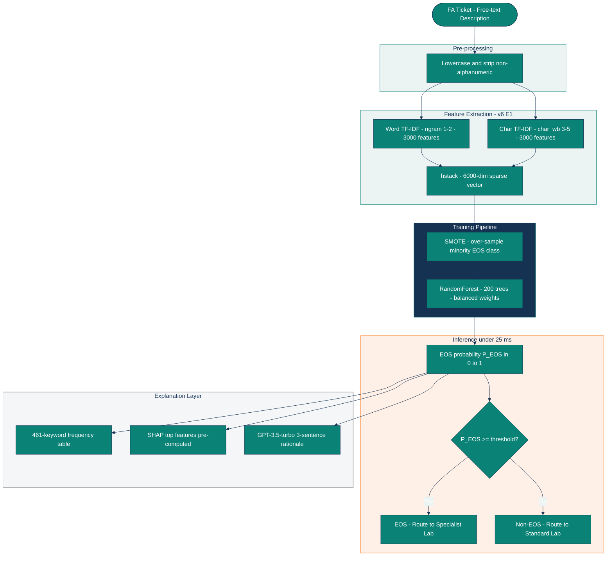
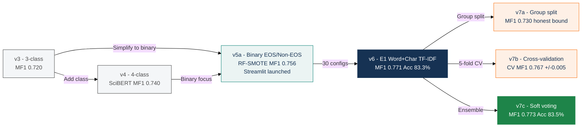
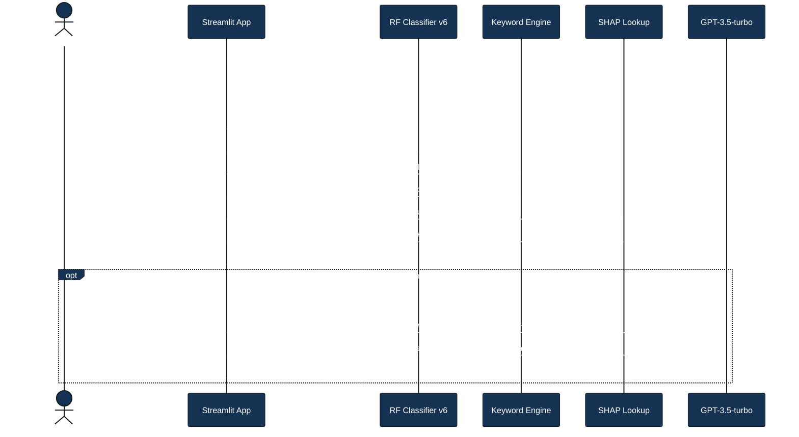
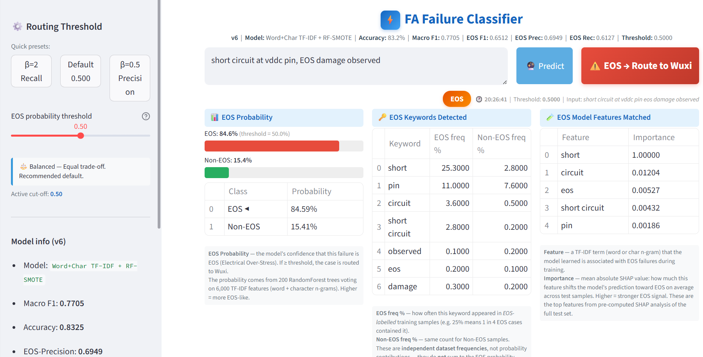
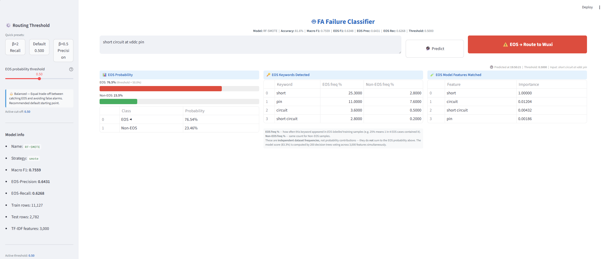

# NLP FA Failure Classifier

> **Binary NLP classifier for semiconductor Failure Analysis (FA) triage.**  
> Predicts whether a free-text failure description is **EOS (Electrical Over-Stress)** or **Non-EOS**
> and surfaces the decision through an interactive Streamlit UI with threshold control,
> keyword-level rationale, SHAP feature attribution, and GPT-assisted natural-language explanation.

---

## Contents

- [Overview](#overview)
- [System Architecture](#system-architecture)
- [Dataset](#dataset)
- [Experiment Journey](#experiment-journey)
- [v6 — 30 Configuration Experiment Suite](#v6--30-configuration-experiment-suite)
- [v7 — Robustness and Ensemble Experiments](#v7--robustness-and-ensemble-experiments)
- [Final Performance](#final-performance)
- [Streamlit UI](#streamlit-ui)
- [Notebooks](#notebooks)
- [Project Structure](#project-structure)
- [Quick Start](#quick-start)

---

## Overview

In semiconductor FA workflows, each incoming ticket contains a free-text description written in
mixed English/German technical language. Routing the ticket to the correct failure analysis lab
requires a human expert to read and classify it — a slow, manual step.

This project automates that routing decision using a trained NLP binary classifier:

| Prediction | Routing Decision |
|---|---|
| **EOS** (Electrical Over-Stress) | Route to specialist EOS lab |
| **Non-EOS** | Route to standard FA lab |

The deployed Streamlit application provides a zero-scroll single-page interface where analysts
paste a failure description and immediately see the routing recommendation alongside confidence
probability, matching EOS keywords, top SHAP model features, and an optional GPT-generated
plain-language explanation.

---

## System Architecture



---

## Dataset

The classifier is trained on **13 917** labelled FA ticket descriptions.

| Property | Value |
|---|---|
| Total rows (after deduplication and length filter) | **13 917** |
| EOS class | 3 554 (25.5%) |
| Non-EOS class | 10 363 (74.5%) |
| Text field | `PSI Failure Desc` — free text, mixed EN/DE |
| Train / Test split | Stratified 80/20 · `random_state=42` |
| Train rows | 11 128 |
| Test rows | 2 782 |

> **Note:** The real corpus contains proprietary failure descriptions and is not distributed
> in this repository. A 200-row **synthetic demo dataset** (`data/v5a_demo_synthetic.csv`)
> with the same schema is provided so the code runs end-to-end on any machine.
> Regenerate: `python data/generate_synthetic_demo.py`

**Class imbalance strategy:** SMOTE over-sampling or `class_weight="balanced"` in all models.
Macro-F1 is the primary metric (treats both classes equally).

---

## Experiment Journey



---

## v6 — 30 Configuration Experiment Suite

Seven experiment tracks run against the same stratified split.
Full results: [`results/v6_all_results.csv`](results/v6_all_results.csv)

| Track | Strategy | Best Macro-F1 | vs v5a baseline |
|---|---|---|---|
| **E1** | **Word TF-IDF(1,2) + Char TF-IDF(3,5) — winner** | **0.7705** | **+0.0146** |
| E2 | BalancedRandomForest variants | 0.7395 | −0.0164 |
| E3 | SMOTE variants (Borderline, KMeans, SMOTEENN) | 0.7523 | −0.0036 |
| E4 | Sentence-transformer hybrid (all-MiniLM-L6-v2) | 0.7598 | +0.0039 |
| E5 | German-to-English translation + TF-IDF | 0.7685 | +0.0126 |
| E6 | Structured columns added | 0.7351 | −0.0208 |
| E7 | Threshold calibration sweep | 0.7541 | −0.0018 |

**Key insight:** Combining word n-grams (1,2) with character n-grams (3,5) captures
sub-word patterns in mixed EN/DE technical jargon.

### Top-5 v6 Models

| Rank | Model | Macro-F1 | Accuracy | EOS-F1 |
|---|---|---|---|---|
| 1 | Word+Char TF-IDF + RF-SMOTE (E1) | **0.7705** | **83.25%** | 0.6512 |
| 2 | Translated + WordChar TF-IDF + SMOTE + RF (E5) | 0.7685 | 83.11% | 0.6482 |
| 3 | char_wb TF-IDF + SMOTE + RF (E1 variant) | 0.7604 | 82.31% | 0.6377 |
| 4 | Hybrid TF-IDF + Semantic + BalancedRF (E4) | 0.7598 | 82.10% | 0.6386 |
| 5 | Semantic + BalancedRF (E4) | 0.7582 | 81.85% | 0.6375 |

---

## v7 — Robustness and Ensemble Experiments

### v7a — Group Split

Multiple FA entries from the same notification ticket can appear on both sides of a
random 80/20 split, inflating the reported performance.
`notebooks/v7a_group_split.ipynb` measures the impact:

| Split | Macro-F1 | Accuracy | EOS-F1 |
|---|---|---|---|
| Standard (may leak) | 0.7705 | 83.25% | 0.6512 |
| **Group-isolated (no leakage)** | **0.7301** | **80.77%** | **0.5876** |

Group leakage inflates performance by ~4 pp Macro-F1. The group-isolated result is the conservative generalisation bound.

### v7b — 5-Fold Cross-Validation

`notebooks/v7b_crossval.ipynb` — executed with per-fold TF-IDF fitting.

| Model | CV Macro-F1 | std | CV Accuracy |
|---|---|---|---|
| v5a: word TF-IDF + SMOTE + RF | 0.7544 | ±0.0027 | 81.12% |
| **v6: word+char TF-IDF + SMOTE + RF** | **0.7673** | **±0.0047** | **82.84%** |
| v6: word+char TF-IDF + BalancedRF | 0.7590 | ±0.0029 | 80.98% |

CV result (0.7673 ± 0.0047) corroborates the hold-out result — the single-split performance is not a lucky outlier.

### v7c — Soft-Voting Ensemble

`notebooks/v7c_ensemble.ipynb` — TF-IDF RF + all-MiniLM-L6-v2 sentence-embedding RF via soft voting.

| Model | Macro-F1 | Accuracy | EOS-F1 |
|---|---|---|---|
| TF-IDF only (v6 base) | 0.7725 | 83.39% | 0.6542 |
| Concat TF-IDF+Embeddings + SMOTE + RF | 0.7602 | 82.85% | 0.6322 |
| **Soft Voting w_tfidf=0.8 — best** | **0.7731** | **83.50%** | **0.6546** |

TF-IDF carries most signal; embeddings add a marginal +0.0007 Macro-F1 lift at 80/20 weight ratio.

---

## Final Performance

| Metric | Value | Source |
|---|---|---|
| **Accuracy** | **83.5%** | v7c Soft Voting · standard split |
| **Macro-F1** | **0.773** | v7c Soft Voting · standard split |
| EOS-F1 | 0.655 | v7c Soft Voting |
| EOS-Precision | 70.3% | v6 champion |
| EOS-Recall | 61.3% | v6 champion |
| 5-fold CV Macro-F1 | 0.767 ± 0.005 | v7b · per-fold TF-IDF fit |
| Group-isolated Macro-F1 | 0.730 | v7a · no notification leakage |
| Inference latency | < 25 ms | RF on 6 000-dim sparse vector |
| Training corpus | 13 917 rows | v5a_eos_vs_noneos.csv |

---

## Streamlit UI



**Features:**
- Colour-coded routing badge (EOS / Non-EOS) with probability bar
- Threshold sidebar: β=2 recall preset, balanced default, β=0.5 precision preset, custom slider
- EOS keyword table: matched terms with EOS frequency vs Non-EOS frequency from training corpus
- SHAP feature table: pre-computed mean |SHAP| values for top EOS features matched to input
- GPT explanation panel: one-click natural-language rationale (requires `OPENAI_API_KEY`)

| v6 UI | v5 UI (previous) |
|---|---|
|  |  |

---

## Notebooks

| Notebook | Status | Description | Key Result |
|---|---|---|---|
| `notebooks/v5a_eos_vs_noneos.ipynb` | Executed | v5a baseline: 30-model comparison, SHAP | MF1 0.756, Acc 81.6% |
| `notebooks/v6_improvement_experiments.ipynb` | Executed | 7 tracks x 30 configs; E1 Word+Char TF-IDF wins | MF1 0.7705, Acc 83.25% |
| `notebooks/v7a_group_split.ipynb` | Executed | Group-deduped split; measures notification leakage | Group MF1 0.730 vs standard 0.771 |
| `notebooks/v7b_crossval.ipynb` | Executed | 5-fold stratified CV; per-fold TF-IDF fit | CV MF1 0.7673 +/-0.0047 |
| `notebooks/v7c_ensemble.ipynb` | Executed | Soft-voting: TF-IDF RF + sentence-embedding RF | MF1 0.7731, Acc 83.50% |
| `notebooks/v5a_WithFullTrain_SciBERT.ipynb` | Executed | SciBERT fine-tune on full train set | MF1 0.769 |
| `notebooks/v5a_WithFullTrain_DeBERTa.ipynb` | Executed | DeBERTa-v3-base fine-tune | MF1 0.767 |
| `notebooks/v7d_transformer_finetune.ipynb` | Template | Full DeBERTa fine-tune with group-split protocol | — |
| `notebooks/v7e_semisupervised.ipynb` | Template | Semi-supervised label propagation | — |

---

## Project Structure

```
nlp-fa-failure-classifier/
├── app/
│   ├── streamlit_app.py            # Main app — v6 model, GPT panel
│   └── streamlit_app_v5a.py        # Previous version kept for reference
├── assets/screenshots/             # UI screenshots
├── data/
│   ├── generate_synthetic_demo.py  # Generate public 200-row demo dataset
│   ├── v5a_demo_synthetic.csv      # Synthetic demo (same schema as real corpus)
│   ├── prepare_v3_data.py
│   └── prepare_v5_data.py
├── evidence/
│   └── claims.json                 # Metric provenance: every number to source
├── keywords/
│   └── keyword_list_v5a.csv        # 461 EOS-discriminant keywords with rates
├── models/
│   └── v6/
│       └── metadata.json           # Training config and evaluation metrics
├── notebooks/                      # See Notebooks table above
├── reports/
│   ├── benchmark_summary.json      # Cross-suite champion summary (v6/v7a/v7b/v7c)
│   └── benchmark_report.md
├── results/
│   ├── v6_all_results.csv          # All 30 v6 experiment results
│   ├── v7a_group_split_results.csv
│   ├── v7b_crossval_results.csv
│   └── v7c_ensemble_results.csv
├── requirements.txt
└── run_streamlit.ps1               # Windows one-click launcher
```

> Model artifacts (`.joblib`, `.pth`) are excluded from version control by `.gitignore`.
> Re-train from the v6 notebook or adapt the pipeline for your own dataset.

---

## Quick Start

```bash
# 1. Install dependencies
python -m venv .venv
.venv\Scripts\activate          # Windows
pip install -r requirements.txt

# 2. Generate synthetic demo data
python data/generate_synthetic_demo.py

# 3. Launch the Streamlit app
streamlit run app/streamlit_app.py
```

Set `OPENAI_API_KEY` in a `.env` file to enable the GPT explanation panel.

---

## Requirements

| Package | Minimum version |
|---|---|
| scikit-learn | 1.8 |
| imbalanced-learn | 0.14 |
| sentence-transformers | 5.2 |
| streamlit | 1.35 |
| openai | 3.3 |
| shap | 0.49 |
| pandas | 2.2 |
| numpy | 1.26 |

---

## Limitations

- Performance is measured on a domain-specific corpus; accuracy on different FA domains or languages may differ.
- Standard-split accuracy (83.5%) is optimistic; the group-isolated bound is 73.0% Macro-F1.
- EOS-recall (61%) is lower than overall accuracy suggests due to class imbalance. Use the β=2 threshold preset when high recall is critical.
- GPT explanations are non-deterministic and intended as analyst guidance, not authoritative root-cause analysis.

---

## License

MIT — see [LICENSE](LICENSE) for details.
